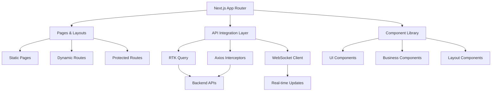

# Projectrix Frontend Documentation


[](https://nextjs.org/)
[](https://typescriptlang.org/)
[](https://reactjs.org/)
[](https://tailwindcss.com/)

## 🚀 Overview

The Projectrix frontend is a modern, responsive web application built with Next.js 15 and TypeScript. It provides an intuitive interface for AI-powered project generation, team collaboration, and developer networking. The application features sophisticated state management, real-time updates, and seamless integration with external services.

## 📋 Table of Contents

- [🏗️ Architecture](#️-architecture)
- [🛠️ Technology Stack](#️-technology-stack)
- [📦 Project Structure](#-project-structure)
- [🔧 Installation & Setup](#-installation--setup)
- [🎨 UI/UX Design System](#-uiux-design-system)
- [🔄 State Management](#-state-management)
- [🔐 Authentication System](#-authentication-system)
- [💳 Payment Integration](#-payment-integration)
- [🤖 AI Integration](#-ai-integration)
- [🔗 API Integration](#-api-integration)
- [📱 Responsive Design](#-responsive-design)
- [🚀 Performance Optimizations](#-performance-optimizations)
- [🧪 Development Guidelines](#-development-guidelines)
- [📚 Component Documentation](#-component-documentation)
- [🔍 Troubleshooting](#-troubleshooting)

## 🏗️ Architecture

### Application Architecture



### Key Architectural Decisions

- **App Router**: Leveraging Next.js 15's App Router for improved performance and developer experience
- **Component-First Design**: Modular, reusable components with clear separation of concerns
- **Type Safety**: Comprehensive TypeScript implementation with strict typing
- **State Management**: Redux Toolkit with RTK Query for efficient data fetching and caching
- **Authentication**: Firebase Auth integration with secure token management
- **Responsive Design**: Mobile-first approach with Tailwind CSS

## 🛠️ Technology Stack

### Core Technologies

| Technology | Version | Purpose |
|------------|---------|---------|
| **Next.js** | 15.1.5 | React framework with App Router |
| **React** | 19.0.0 | UI library with latest features |
| **TypeScript** | 5.0+ | Type safety and developer experience |
| **Tailwind CSS** | 3.4.1 | Utility-first CSS framework |

### State Management & Data Fetching

| Library | Purpose |
|---------|---------|
| **Redux Toolkit** | State management |
| **RTK Query** | Data fetching and caching |
| **Redux Persist** | State persistence |

### UI & Animation

| Library | Purpose |
|---------|---------|
| **Radix UI** | Headless UI components |
| **Framer Motion** | Animations and transitions |
| **Lucide React** | Icon library |
| **Sonner** | Toast notifications |

### Form Handling & Validation

| Library | Purpose |
|---------|---------|
| **React Hook Form** | Form management |
| **Zod** | Schema validation |
| **@hookform/resolvers** | Form validation integration |

### Authentication & Services

| Service | Purpose |
|---------|---------|
| **Firebase Auth** | User authentication |
| **Axios** | HTTP client |
| **Socket.io Client** | Real-time communication |

## 📦 Project Structure

```
client/
├── public/                          # Static assets
│   ├── logo.png                    # Brand assets
│   ├── favicon.ico                 # Site favicon
│   └── robots.txt                  # SEO configuration
├── src/
│   ├── app/                        # Next.js App Router
│   │   ├── (pages)/               # Route groups
│   │   │   ├── about/             # About page
│   │   │   ├── admin/             # Admin dashboard
│   │   │   ├── collaborations/    # Collaboration management
│   │   │   ├── generate/          # AI project generation
│   │   │   ├── pricing/           # Subscription plans
│   │   │   └── profile/           # User profiles
│   │   ├── api/                   # API slice definitions
│   │   │   ├── apiSlice.ts        # Base API configuration
│   │   │   ├── projectApiSlice.ts # Project-related APIs
│   │   │   ├── paymentApiSlice.ts # Payment APIs
│   │   │   └── ...                # Other API slices
│   │   ├── context/               # React contexts
│   │   │   ├── AuthContext.tsx    # Authentication context
│   │   │   └── SocketContext.tsx  # WebSocket context
│   │   ├── hooks/                 # Custom React hooks
│   │   │   ├── useAuth.ts         # Authentication hooks
│   │   │   ├── usePayment.ts      # Payment hooks
│   │   │   └── ProtectedRoute.tsx # Route protection
│   │   ├── store/                 # Redux store configuration
│   │   │   ├── index.ts           # Store setup
│   │   │   └── features/          # Redux slices
│   │   ├── types/                 # TypeScript type definitions
│   │   │   ├── projectTypes.ts    # Project-related types
│   │   │   ├── userTypes.ts       # User-related types
│   │   │   └── ...                # Other type definitions
│   │   ├── utils/                 # Utility functions
│   │   │   ├── api.ts             # API utilities
│   │   │   ├── firebase.ts        # Firebase configuration
│   │   │   └── ...                # Other utilities
│   │   ├── globals.css            # Global styles
│   │   ├── layout.tsx             # Root layout
│   │   └── page.tsx               # Home page
│   ├── components/                # Reusable components
│   │   ├── ui/                    # Base UI components
│   │   │   ├── button.tsx         # Button component
│   │   │   ├── card.tsx           # Card component
│   │   │   ├── input.tsx          # Input component
│   │   │   └── ...                # Other UI components
│   │   ├── Header.tsx             # Navigation header
│   │   ├── Footer.tsx             # Site footer
│   │   ├── ProjectCard.tsx        # Project display card
│   │   ├── PaymentModal.tsx       # Payment processing modal
│   │   └── ...                    # Other business components
│   └── lib/                       # Library configurations
│       └── utils.ts               # Shared utilities
├── tailwind.config.ts             # Tailwind configuration
├── next.config.ts                 # Next.js configuration
├── tsconfig.json                  # TypeScript configuration
├── package.json                   # Dependencies and scripts
└── README.md                      # This documentation
```

## 🔧 Installation & Setup

### Prerequisites

- **Node.js**: Version 18.17 or higher
- **npm**: Version 9.0 or higher
- **Git**: For version control

### Environment Variables

Create a `.env.local` file in the client directory:

```bash
# Firebase Configuration
NEXT_PUBLIC_FIREBASE_API_KEY=your_firebase_api_key
NEXT_PUBLIC_FIREBASE_AUTH_DOMAIN=your_project.firebaseapp.com
NEXT_PUBLIC_FIREBASE_PROJECT_ID=your_project_id
NEXT_PUBLIC_FIREBASE_STORAGE_BUCKET=your_project.appspot.com
NEXT_PUBLIC_FIREBASE_MESSAGING_SENDER_ID=your_sender_id
NEXT_PUBLIC_FIREBASE_APP_ID=your_app_id

# API Configuration
NEXT_PUBLIC_API_URL=http://localhost:5000/api/v1
NEXT_PUBLIC_SOCKET_URL=http://localhost:5000

# Payment Configuration
NEXT_PUBLIC_STRIPE_PUBLISHABLE_KEY=pk_test_...
NEXT_PUBLIC_FLUTTERWAVE_PUBLIC_KEY=FLWPUBK_TEST-...

# Application Configuration
NEXT_PUBLIC_APP_NAME=Projectrix
NEXT_PUBLIC_APP_URL=http://localhost:3000
```

### Installation Steps

1. **Clone the repository**
   ```bash
   git clone <repository-url>
   cd gdg-project-generator/client
   ```

2. **Install dependencies**
   ```bash
   npm install
   ```

3. **Set up environment variables**
   ```bash
   cp .env.example .env.local
   # Edit .env.local with your configuration
   ```

4. **Start development server**
   ```bash
   npm run dev
   ```

5. **Build for production**
   ```bash
   npm run build
   npm start
   ```

### Available Scripts

| Script | Purpose |
|--------|---------|
| `npm run dev` | Start development server |
| `npm run build` | Build for production |
| `npm start` | Start production server |
| `npm run lint` | Run ESLint |
| `npm run type-check` | Run TypeScript compiler |

## 🎨 UI/UX Design System

### Design Principles

1. **Consistency**: Uniform design patterns across all components
2. **Accessibility**: WCAG 2.1 AA compliant interfaces
3. **Performance**: Optimized for fast loading and smooth interactions
4. **Responsiveness**: Mobile-first design approach

### Color Palette

```css
:root {
  /* Primary Colors */
  --primary: 220 14% 96%;
  --primary-foreground: 220 9% 46%;
  
  /* Background Colors */
  --background: 0 0% 100%;
  --foreground: 224 71% 4%;
  
  /* Accent Colors */
  --blue-gradient: linear-gradient(to right, #1e3a8a, #1d4ed8);
  --success: 142 76% 36%;
  --warning: 38 92% 50%;
  --error: 0 72% 51%;
}
```

### Component Variants

#### Button Variants

```tsx
// Primary button
<Button className="bg-black text-white hover:bg-black/90">
  Primary Action
</Button>

// Secondary button
<Button variant="outline" className="border-black text-black">
  Secondary Action
</Button>

// Gradient button
<Button className="bg-gradient-to-r from-blue-900 to-blue-600">
  Gradient Action
</Button>
```

## 🔄 State Management

### Redux Store Architecture

```typescript
// Store Structure
interface RootState {
  auth: AuthState;
  projects: ProjectState;
  collaboration: CollaborationState;
  ui: UIState;
}

// Auth State
interface AuthState {
  user: UserData | null;
  loading: boolean;
  error: string | null;
}

// Project State
interface ProjectState {
  currentProject: Project | null;
  savedProjects: Project[];
  publishedProjects: Project[];
  loading: boolean;
}
```

### RTK Query API Slices

```typescript
export const projectApi = createApi({
  reducerPath: 'projectApi',
  baseQuery: fetchBaseQuery({
    baseUrl: '/api/v1/',
    prepareHeaders: (headers, { getState }) => {
      const token = localStorage.getItem('token');
      if (token) {
        headers.set('authorization', `Bearer ${token}`);
      }
      return headers;
    },
  }),
  tagTypes: ['Project', 'User'],
  endpoints: (builder) => ({
    generateProject: builder.mutation<ProjectResponse, GenerateProjectRequest>({
      query: (data) => ({
        url: 'generate/project',
        method: 'POST',
        body: data,
      }),
      invalidatesTags: ['Project'],
    }),
    // ... other endpoints
  }),
});
```

## 🔐 Authentication System

### Firebase Auth Integration

```typescript
// Firebase Configuration
const firebaseConfig = {
  apiKey: process.env.NEXT_PUBLIC_FIREBASE_API_KEY,
  authDomain: process.env.NEXT_PUBLIC_FIREBASE_AUTH_DOMAIN,
  projectId: process.env.NEXT_PUBLIC_FIREBASE_PROJECT_ID,
  // ... other config
};

const app = initializeApp(firebaseConfig);
export const auth = getAuth(app);
export const githubProvider = new GithubAuthProvider();
```

### Authentication Flow

1. **Login Process**
   ```typescript
   const login = async () => {
     try {
       const result = await signInWithPopup(auth, githubProvider);
       const token = await result.user.getIdToken();
       
       // Send token to backend for verification
       const response = await api.post('/auth/github', { token });
       setUser(response.data.user);
     } catch (error) {
       handleAuthError(error);
     }
   };
   ```

2. **Token Management**
   - Automatic token refresh every 10 minutes
   - Secure token storage in localStorage
   - Token validation on API requests

3. **Route Protection**
   ```typescript
   const ProtectedRoute: React.FC<{ children: React.ReactNode }> = ({ children }) => {
     const { user, loading } = useAuth();
     
     if (loading) return <LoadingSpinner />;
     if (!user) return <LoginPrompt />;
     
     return <>{children}</>;
   };
   ```

## 💳 Payment Integration

### Multi-Provider Payment System

```typescript
const usePayment = () => {
  const [createPaymentSession] = useCreatePaymentSessionMutation();
  
  const initializePayment = async (currency: 'NGN' | 'USD') => {
    try {
      const response = await createPaymentSession({
        phoneNumber: userPhone,
        currency,
      });
      
      // Redirect to payment page
      window.location.href = response.data.payment.paymentLink;
    } catch (error) {
      toast.error('Payment initialization failed');
    }
  };
  
  return { initializePayment };
};
```

## 🤖 AI Integration

### Project Generation System

```typescript
interface GenerationParams {
  technologies: string[];
  complexity: {
    level: 'beginner' | 'intermediate' | 'advanced';
    percentage: number;
  };
  duration: 'small' | 'medium' | 'large';
  teamSize: 'solo' | 'small' | 'medium';
  exactTeamSize?: string;
  category: 'web' | 'mobile' | 'ai' | 'game' | 'data';
  projectTheme?: string;
}

const handleGenerate = async (params: GenerationParams) => {
  try {
    setGenerating(true);
    const result = await generateProject(params).unwrap();
    
    setCurrentProject(result.project);
    
    if (result.warning) {
      toast.warning(result.warning, {
        duration: 5000,
        icon: <AlertTriangle className="h-5 w-5 text-yellow-500" />
      });
    }
    
    toast.success('Project idea generated successfully!');
  } catch (error) {
    toast.error('Failed to generate project');
  } finally {
    setGenerating(false);
  }
};
```

## 📚 Component Documentation

### Core UI Components

#### Button Component

```typescript
interface ButtonProps extends React.ButtonHTMLAttributes<HTMLButtonElement> {
  variant?: 'default' | 'destructive' | 'outline' | 'secondary' | 'ghost' | 'link';
  size?: 'default' | 'sm' | 'lg' | 'icon';
}

/**
 * Button component with multiple variants and sizes
 * 
 * @example
 * <Button variant="outline" size="lg">
 *   Click me
 * </Button>
 */
const Button = React.forwardRef<HTMLButtonElement, ButtonProps>(
  ({ className, variant = "default", size = "default", ...props }, ref) => {
    return (
      <button
        className={cn(buttonVariants({ variant, size, className }))}
        ref={ref}
        {...props}
      />
    );
  }
);
```

#### ProjectCard Component

```typescript
interface ProjectCardProps {
  project: Project;
  showActions?: boolean;
  onEdit?: (project: Project) => void;
  onDelete?: (project: Project) => void;
}

/**
 * ProjectCard displays project information with optional actions
 * 
 * Features:
 * - Responsive design
 * - Technology badges
 * - Team structure visualization
 * - Action buttons
 * 
 * @example
 * <ProjectCard
 *   project={project}
 *   showActions={true}
 *   onEdit={handleEdit}
 * />
 */
const ProjectCard: React.FC<ProjectCardProps> = ({
  project,
  showActions = false,
  onEdit,
  onDelete
}) => {
  // Component implementation
};
```

## 🔍 Troubleshooting

### Common Issues & Solutions

#### Authentication Issues

**Issue**: Firebase token expires frequently
```typescript
// Solution: Implement automatic token refresh
useEffect(() => {
  const refreshToken = setInterval(async () => {
    if (firebaseUser) {
      const token = await firebaseUser.getIdToken(true);
      localStorage.setItem('token', token);
    }
  }, 10 * 60 * 1000); // 10 minutes

  return () => clearInterval(refreshToken);
}, [firebaseUser]);
```

#### API Integration Issues

**Issue**: CORS errors during development
```typescript
// Solution: Ensure API base URL is correct
const api = axios.create({
  baseURL: process.env.NEXT_PUBLIC_API_URL || 'http://localhost:5000/api/v1',
  withCredentials: true,
});
```

### Development Tools

#### Browser Extensions
- **React Developer Tools**: Debug React components and hooks
- **Redux DevTools**: Inspect Redux state and actions
- **Lighthouse**: Performance and accessibility auditing

#### Debugging Commands

```bash
# Check for TypeScript errors
npm run type-check

# Lint code
npm run lint

# Check bundle size
npm run build
npm run analyze
```

---

## 📄 License

This project is part of the Projectrix platform. All rights reserved.

## 🤝 Contributing

Please refer to the main project documentation for contribution guidelines.

---

*Built with ❤️ using Next.js, TypeScript, and modern web technologies.*